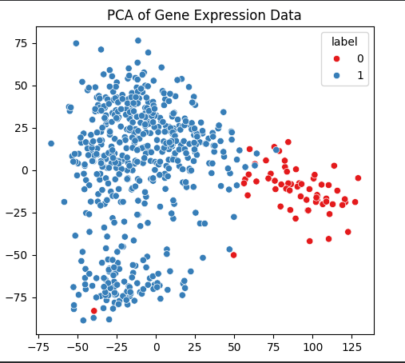
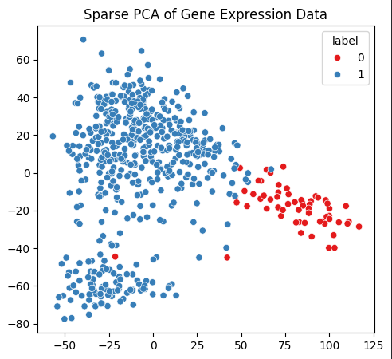

# Sparse PCA for Gene Expression Analysis

## Overview

High-dimensional biological datasets such as gene expression profiles often contain **thousands of genes but relatively few samples**.  
Traditional Principal Component Analysis (PCA) reduces dimensionality but produces components that depend on **all genes**, making interpretation difficult.

This project compares **PCA** and **Sparse PCA** on a breast cancer gene expression dataset and demonstrates how Sparse PCA can identify a **small subset of important genes** while maintaining similar reconstruction performance.

The analysis focuses on:

- Dimensionality reduction of high-dimensional gene expression data
- Comparison between PCA and Sparse PCA
- Investigating sparsity and interpretability of principal components


---

## Dataset

Dataset: **Gene Expression Profiles of Breast Cancer**

The dataset contains gene expression measurements for:

- **Normal breast tissue samples**
- **Breast tumor samples**

After preprocessing:

- **Samples:** ~592  
- **Genes:** ~17,814

Each row corresponds to a **sample**, and each column corresponds to a **gene expression feature**.


---

## Methods

### Principal Component Analysis (PCA)

PCA finds orthogonal directions that maximize variance in the data.  
However, PCA components are **dense**, meaning they use contributions from nearly all genes.

### Sparse PCA

Sparse PCA introduces an **L1 regularization penalty** to enforce sparsity in the component loadings.  
This allows the model to select only a **small subset of genes** that contribute to each principal component.

Benefits:

- Improved interpretability
- Gene selection capability
- Maintains similar reconstruction performance


---

## Experiments

The analysis includes:

1. **Data preprocessing**
   - Handling missing values
   - Standardization of gene expression features

2. **Dimensionality reduction**
   - PCA projection
   - Sparse PCA projection

3. **Model comparison**
   - Reconstruction error
   - Sparsity of component loadings

4. **Visualization**
   - PCA projection of samples
   - Sparse PCA projection of samples
   - Sparsity vs regularization parameter


---

## Results

Key observations:

- PCA achieves slightly lower reconstruction error.
- Sparse PCA maintains similar reconstruction performance while using **far fewer genes**.
- Sparse PCA improves interpretability by identifying a **subset of informative genes**.

Example comparison:

| Method | Reconstruction Error | Gene Usage |
|------|------|------|
| PCA | Lower | Uses all genes |
| Sparse PCA | Slightly higher | Uses small subset of genes |


---

## Example Visualizations

### PCA Projection



### Sparse PCA Projection




---

## Installation

Clone the repository:

```bash
git clone https://github.com/yourusername/Sparse-PCA-for-Gene-Expression-Analysis.git
cd Sparse-PCA-for-Gene-Expression-Analysis
```
Install dependencies:
```
pip install numpy pandas scikit-learn matplotlib
```
## Applications

Sparse PCA is widely used in:

- Bioinformatics
- Genomics
- Finance factor models
- High-dimensional data analysis

# Future Possible extensions:

- Gene importance analysis
- Biological pathway interpretation
- Classification of tumor vs normal samples
- Integration with deep learning feature extraction
## Author

Yit Xiaang Ztang
University of Minnesota
